

# **Setup of MetalLB**

## 1. **Requirement of MetalLB**

In the bare metal deployment kubernetes does not provide the functionality of creating Load Balancer on service by default

### 2. Environment detail (OS Version ) :

  * Distributor ID : Ubuntu
  * Description : Ubuntu 22.04.3 LTS
  * Release : 20.04
  * Codename : jammy

### 3. List of tools and technologies:

  * Kubernetes
  * MetalLB
  * Docker

## a. Definition of Kubernetes :

Think of Kubernetes as a smart manager for your applications. Imagine you have lots of little workers (containers) who need to run your programs. Kubernetes is like a boss who organises and manages these workers efficiently. It makes sure your programs are running, scales them when needed, and even replaces them if they fail.

## b. Definition of MetalLB :
Picture MetalLB as a friendly valet for your apps in Kubernetes. Normally, LoadBalancers help direct internet traffic to different services, like websites or apps. MetalLB does this even if you're not on a big cloud service (like Amazon or Google). It helps your Kubernetes apps get the right traffic and lets them talk to the world.

### MetalLB Architecture diagram :

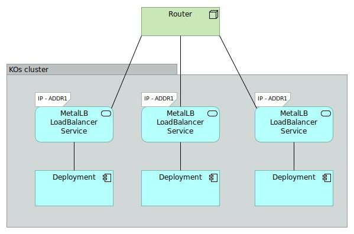

### c. Definition of Podman/Docker :

Docker and Podman are tools used for containerization , which helps package and
run applications with all their dependencies in isolated environments. Docker is
widely known and uses a central daemon, while Podman o�ers similar
functionality without a central daemon, making it more lightweight and secure.
Both simplify so�ware deployment across di�erent systems.

# 4. Command for the setup or configuration :

### a. Install Kubernetes
Here's a general outline of the steps you would follow to install Kubernetes on Ubuntu:

 ### **Step 1 :** Update and Upgrade 
###### **Command:**
~~~
sudo apt-get update
~~~

* **sudo:** This command is used to execute another command with superuser (administrator) privileges.
* **apt-get:** This is the package management command-line tool for Debian-based Linux distributions. It's used to interact with the Advanced Package Tool (APT) system, which handles package installation, removal, and maintenance.
* **update:** This is a subcommand of apt-get. When you run apt-get update, it refreshes the local package cache by contacting the package repositories configured on your system.

###### **Command:**
~~~
sudo apt-get upgrade
~~~

* **sudo:** This command is used to execute another command with superuser (administrator) privileges.
* **apt-get:** This is the package management command-line tool for Debian-based Linux distributions. It's used to interact with the Advanced Package Tool (APT) system, which handles package installation, removal, and maintenance.
* **upgrade:** This is a sub-command of apt-get. When used in combination with apt-get, it tells the package manager to upgrade the currently installed packages to their latest versions.

### **Step 2:**
### b. **Install Docker :**
 Kubernetes relies on Docker for containerization. Install Docker using the following commands:
###### **Command:**
~~~
sudo apt-get install docker.io
~~~

*  **sudo:** As mentioned before, this stands for "Super User Do" and is used to execute the command with superuser (root) privileges. This is necessary because installing software typically requires administrative privileges.

* **apt-get:** This is the package handling utility for Debian-based systems, used to manage software packages.

* **install:**  This is a sub-command of apt-get. When used in combination with apt-get, it specifies that you want to install a package.
* **docker.io:** This is the name of the package you want to install. In this case, it's the Docker package. Docker is a platform that allows you to automate the deployment, scaling, and management of applications using containerization.

###### **Command:**

~~~
sudo systemctl enable docker
~~~
* **sudo:** As before, this stands for "Super User Do" and is used to execute the command with superuser (root) privileges.
* **systemctl:** This is a command-line tool used to interact with systemd, which is the init system and service manager for modern Linux distributions. It's responsible for managing the services and processes that run on the system.

*  **enable:** This is an option of the systemctl command. When you use enable, you're instructing systemd to set up the specified service to start automatically when the system boots up.

* **docker:** This is the name of the service you want to enable. In this case, it refers to the Docker service. The Docker service manages the Docker daemon, which in turn manages container processes on the system.

###### **Command:**
~~~
 sudo systemctl start docker
~~~
* **sudo:** This stands for "Super User Do" and is used to execute the command with superuser (root) privileges.
* **systemctl:** This is a command-line tool used to interact with the systemd init system, which is responsible for managing services and processes on the system.
* **start:** This is an option of the systemctl command. When you use start, you're instructing systemd to initiate the specified service and start running it.
* **docker:** This is the name of the service you want to start. In this case, it refers to the Docker service, which manages the Docker daemon responsible for managing container processes on the system.

### Step 3 : 

### c. **Install kubeadm, kubelet, and kubectl :** 
These are the essential components of Kubernetes.
 
###### **Command:** 

 ~~~
  sudo apt-get install -y apt-transport-https curl
~~~

* **sudo:** This stands for "Super User Do" and is used to execute the command with superuser (root) privileges.
* **apt-get:** This is the package handling utility for Debian-based systems, used to manage software packages.
* **install:** This is a sub-command of apt-get, indicating that you want to install one or more packages.
* **-y:** This is an option for apt-get that automatically answers "yes" to any prompts that might appear during the installation process.
* **apt-transport-https:** This is the name of the package you want to install. It provides the ability to securely download packages using the HTTPS protocol instead of regular HTTP.
* **curl:** This is the name of another package you want to install. It's a command-line tool used to transfer data to or from a server, supporting various protocols including HTTP and HTTPS.

~~~
curl -s https://packages.cloud.google.com/apt/doc/apt-key.gpg | sudo apt-key add -
~~~

* **curl:** This is a command-line tool that allows you to transfer data to or from a server using various protocols, such as HTTP and HTTPS.

* **-s:** This is an option for curl that stands for "silent" or "quiet." It suppresses the progress output and only displays the final result of the command.

* **https://packages.cloud.google.com/apt/doc/apt-key.gpg:** This is the URL from which the GPG key is being downloaded. This key is used to verify the authenticity of packages from the Google Cloud package repository.

* **|:** This is a pipe operator that takes the output of the command on its left side and uses it as input for the command on its right side.

* **sudo:** This is used to execute the subsequent command with superuser (root) privileges.

* **apt-key:** This is a command used to manage GPG keys in the APT package manager. It's used to add or remove keys from the keyring that APT uses to verify package authenticity.

* **add -:** This part of the command tells apt-key to add a GPG key to the keyring. The - at the end indicates that the input for the key is taken from standard input, which in this case is the output of the curl command on the left side of the pipe.

~~~
echo "deb https://apt.kubernetes.io/ kubernetes-xenial main" | sudo tee /etc/apt/sources.list.d/kubernetes.list
~~~

* **echo:** This is a command that simply prints the specified text to the terminal.

* **"deb https://apt.kubernetes.io/ kubernetes-xenial main":** This is the text that the echo command is printing. It's a repository source configuration line for APT, the package manager used in Debian-based Linux distributions.

* **|:** This is a pipe operator that takes the output of the command on its left side and uses it as input for the command on its right side.

* **sudo:** This is used to execute the following command with superuser (root) privileges.

* **tee:** This command is used to read from standard input and write to standard output and files. When used with the sudo command, it allows you to write to files with root privileges.

* **/etc/apt/sources.list.d/kubernetes.list:** This is the file path where the output of the echo command will be written. It's adding the new repository source to a file in the /etc/apt/sources.list.d/ directory with the name kubernetes.list.

###### **Command:** 

~~~
sudo apt-get update
sudo apt-get install -y kubelet kubeadm kubectl
~~~

* **sudo:** As before, this stands for "Super User Do" and is used to execute the command with superuser (root) privileges.

* **apt-get:** This is the package handling utility for Debian-based systems, used to manage software packages.

* **install:** This is a sub-command of apt-get, indicating that you want to install one or more packages.

* **-y:** This is an option for apt-get that automatically answers "yes" to any prompts that might appear during the installation process. It helps to automate the installation, as you won't need to manually confirm the installation.

* **kubelet:** This is one of the Kubernetes components. The kubelet is an agent that runs on each node in the cluster. It ensures that containers are running in a Pod.

* **kubeadm:** This is a tool used to bootstrap and manage a Kubernetes cluster. It simplifies the process of setting up a cluster on multiple nodes.

* **kubectl:** This is the command-line tool for interacting with Kubernetes clusters. It allows you to manage and control Kubernetes resources and deployments.

### Step 4 :

 **Initialize Kubernetes Master Node (Control Plane) :** On the master node, you'll initialize Kubernetes using kubeadm. Run the following command to initialize the master node:
  
###### **Command:** 

~~~
sudo kubeadm init
~~~

* **sudo:** This stands for "Super User Do" and is used to execute the command with superuser (root) privileges. Initializing a Kubernetes control plane requires administrative privileges.

* **kubeadm:** This is a command-line tool used to bootstrap and manage Kubernetes clusters. It simplifies the process of setting up a Kubernetes cluster.

* **init:** This is a sub-command of kubeadm. When you run kubeadm init, you're instructing kubeadm to initialize the control plane of the Kubernetes cluster.

**Error:**

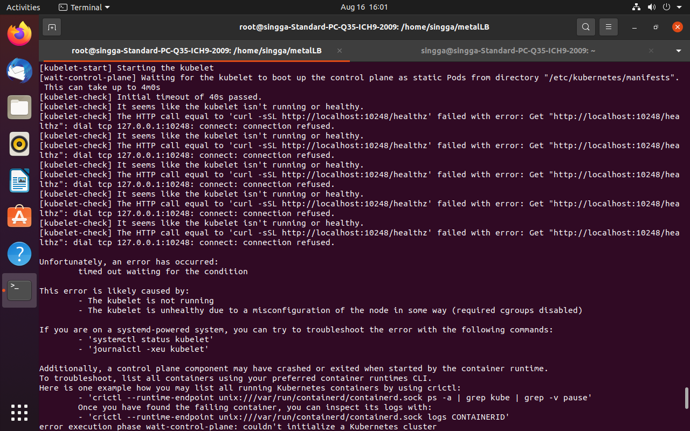

**According to the document I have faced the issue.**

 **PROBLEM 1:**

So, I have followed these steps to install the Minikube cluster on my system Ubuntu 20.04:  for setup of metalLB. 

 # **Installation of Minikube Cluster**

**Step 1:** **Installing Minikube**

###### **Command:**

~~~
wgethttps://storage.googleapis.com/minikube/releases/latest/minikube-linux-amd64
~~~

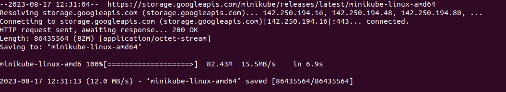

#### Step 2:
 Then copy the downloaded binary to the system path using the following  

###### **command:** 

~~~
cp minikube-linux-amd64 /usr/local/bin/minikube
~~~

* **cp:** This is the command for copying files or directories.

* **minikube-linux-amd64:** This is the name of the source file that you want to copy. It seems to be a binary file for the Minikube tool specifically built for 64-bit Linux systems.

* **/usr/local/bin/minikube:** This is the destination path where you want to copy the file. It's specifying that you want to copy the "minikube-linux-amd64" file to the "/usr/local/bin/" directory and rename it to "minikube" without the "-linux-amd64" part.

#### Step 3:
Provide the execution permission

###### **Command:**
~~~
 chmod 755 /usr/local/bin/minikube
~~~

* **chmod:** This is the command for changing the permissions of files or directories.

* **755:** This is a numeric representation of the permissions you want to set. In Linux file permissions, these three digits represent different levels of access: owner, group, and others.

* **/usr/local/bin/minikube:** This is the path to the "minikube" binary file for which you're changing the permissions.

#### Step 4:

Then check the minikube version.

###### **Command:**
~~~
 minikube version
~~~

* **minikube:** This is the command-line tool you're executing. It's used to manage local Kubernetes clusters.

* **version:** This is a sub-command of the minikube tool. When you run minikube version, it instructs the Minikube tool to display information about the version of the tool itself.

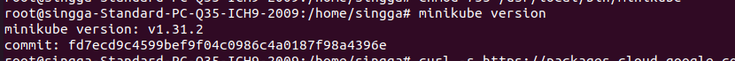

### Install kubectl

#### Step 5:

 Install Kubectl and other tools to manage applications on Kubernetes. First, add the GPG key with the following command:

###### **Command:**
~~~
 curl -s https://packages.cloud.google.com/apt/doc/apt-key.gpg | apt-key add
~~~

* **curl:** This is a command-line tool used to transfer data to or from a server using various protocols, including HTTP and HTTPS.

* **-s:** This is an option for curl that stands for "silent" or "quiet." It suppresses the progress output and only displays the final result of the command.

* **https://packages.cloud.google.com/apt/doc/apt-key.gpg:** This is the URL from which the GPG key is being downloaded. GPG keys are used to sign and verify packages to ensure their authenticity.

* **|:** This is a pipe operator that takes the output of the command on its left side and uses it as input for the command on its right side.

* **apt-key add:** This command is used to manage GPG keys in the APT package manager. It's used to add keys to the trusted keys list, allowing APT to verify the authenticity of packages from specific repositories.

#### Step 6:

Then add the kubectl repository

###### **Command:**
~~~
echo "deb http://apt.kubernetes.io/ kubernetes-xenial main" | tee /etc/apt/sources.list.d/kubernetes.list
~~~

* **echo:** This is a command that prints the specified text to the terminal.

* **"deb http://apt.kubernetes.io/ kubernetes-xenial main":** This is the text that the echo command is printing. It's a repository source configuration line for APT, the package manager used in Debian-based Linux distributions. 

* **|:** This is a pipe operator that takes the output of the command on its left side and uses it as input for the command on its right side.

* **tee:** This command is used to read from standard input and write to standard output and files. It's used here to write the output of the echo command to a file.

* **/etc/apt/sources.list.d/kubernetes.list:** This is the file path where the output of the echo command will be written. It's specifying that you want to write the repository configuration line to a file named "kubernetes.list" in the /etc/apt/sources.list.d/ directory.

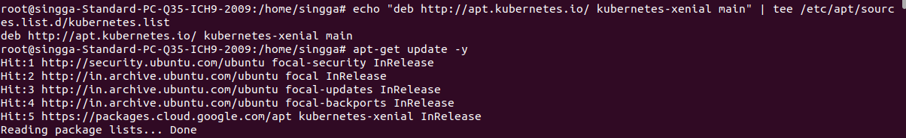

#### Step 7:

 **install Kubectl**

###### **Command:**
~~~
apt-get update -y
apt-get install kubectl kubeadm kubectl -y
~~~

* **apt-get:** This is the package handling utility for Debian-based systems, used to manage software packages.

* **update:** This is a sub-command of apt-get. When you run apt-get update, it instructs APT to update its package database by fetching the latest package information from the repositories.

* **-y:** This is an option for apt-get that automatically answers "yes" to any prompts that might appear during the update process. It helps to automate the update, as you won't need to manually confirm the update.

* **install:** This is a sub-command of apt-get, indicating that you want to install one or more packages.

* **kubectl:** This is the command-line tool for interacting with Kubernetes clusters. It allows you to manage and control Kubernetes resources and deployments.

* **kubeadm:** This is a tool used to bootstrap and manage a Kubernetes cluster. It simplifies the process of setting up a cluster on multiple nodes.

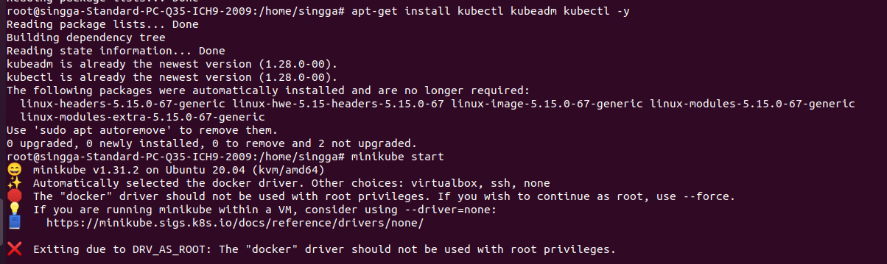

### Start Minikube

**Step 8:**
 Then we start the Minikube.

###### **Command:**
~~~
minikube start --force
~~~

* **minikube:** This is the command-line tool used to manage local Kubernetes clusters using a virtual machine driver (such as VirtualBox, KVM, or Docker).

* **start:** This is a sub-command of minikube. When you run minikube start, it instructs Minikube to start a Kubernetes cluster.

* **--force:** This is a flag or option that you're passing to the minikube start command. It indicates that you want to forcefully start the Minikube cluster. This is useful when you want to ensure that the cluster starts even if there might be some conflicting or incomplete configurations.

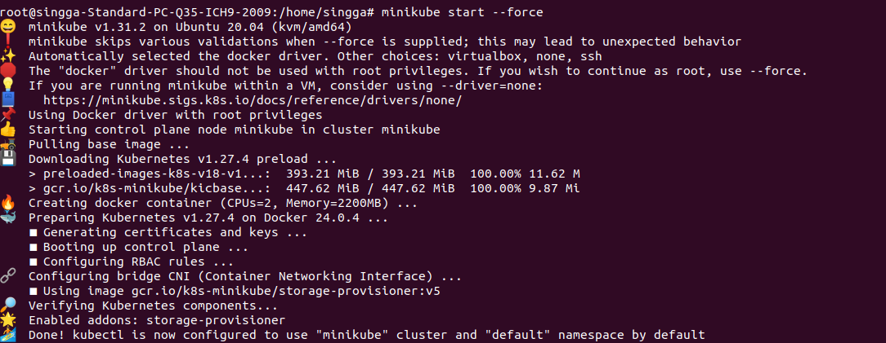

#### Step 9:

Then check the cluster information

###### **Command:**

~~~
kubectl cluster-info
~~~

* **kubectl:** This is the command-line tool for interacting with Kubernetes clusters. It allows you to manage and control Kubernetes resources and deployments.

* **cluster-info:** This is a sub-command of kubectl. When you run kubectl cluster-info, it instructs kubectl to display information about the Kubernetes cluster.

#### Step 10:
Then check the Kubectl default configuration

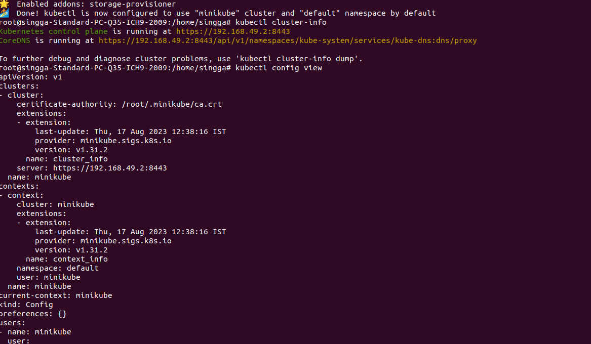

#### Step 11:

 Then check all the running nodes 

###### **Command:**
~~~
kubectl get nodes
~~~

* **kubectl:** This is the command-line tool for interacting with Kubernetes clusters. It allows you to manage and control Kubernetes resources and deployments.

* **get nodes:** This is a sub-command of kubectl. When you run kubectl get nodes, it instructs kubectl to retrieve and display information about the nodes in the cluster.

#### Step 12:

Then verify the status of Minikube

###### **Command:**
~~~
minikube status
~~~

* **minikube:** This is the command-line tool used to manage local Kubernetes clusters using a virtual machine driver (such as VirtualBox, KVM, or Docker).

* **status:** This is a sub-command of minikube. When you run minikube status, it instructs Minikube to display the status of the local Kubernetes cluster.

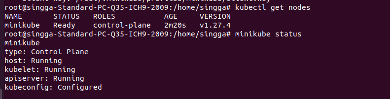

#### Step 13:

Then list all addons in minikube.

###### **Command:**
~~~
minikube addons list
~~~

* **minikube:** This is the command-line tool used to manage local Kubernetes clusters using a virtual machine driver (such as VirtualBox, KVM, or Docker).

* **addons list:** This is a sub-command of minikube. When you run minikube addons list, it instructs Minikube to list the available add-ons that can be managed within the cluster.

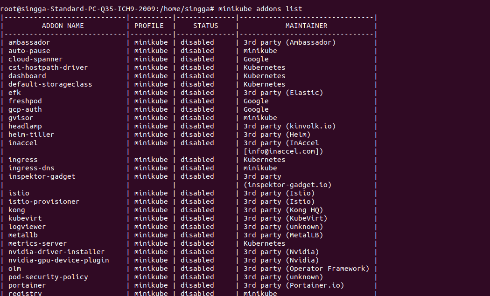

#### Step 14:
 Then list all the container image running in the cluster 

###### **Command:**
~~~
kubectl get pods --all-namespaces
~~~

* **kubectl:** This is the command-line tool for interacting with Kubernetes clusters. It allows you to manage and control Kubernetes resources and deployments.

* **get pods:** This is a sub-command of kubectl. When you run kubectl get pods, it instructs kubectl to retrieve and display information about pods in the specified namespace (or all namespaces if not specified).

* **--all-namespaces:** This is a flag or option that you're passing to the kubectl get pods command. It indicates that you want to retrieve pods from all namespaces in the cluster, not just the current namespace.

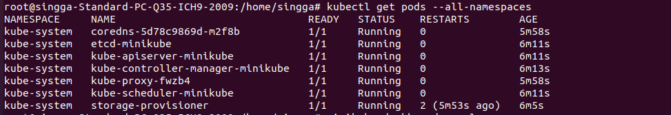

#### Step 15:

Enable the Kubernetes dashboard and get the URL

###### **Command:** 
~~~
minikube dashboard --url
~~~

* **minikube:** This is the command-line tool used to manage local Kubernetes clusters using a virtual machine driver (such as VirtualBox, KVM, or Docker).

* **dashboard:** This is a sub-command of minikube. When you run minikube dashboard, it instructs Minikube to open the web-based dashboard for your local Kubernetes cluster.

* **--url:** This is a flag or option that you're passing to the minikube dashboard command. It indicates that you want to retrieve the URL to access the dashboard without actually opening it in a web browser.

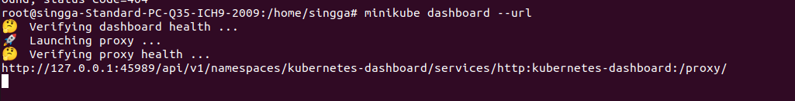

#### Step 16:

On the browser we have passed the url then it opens the dashboard.

**Output:**

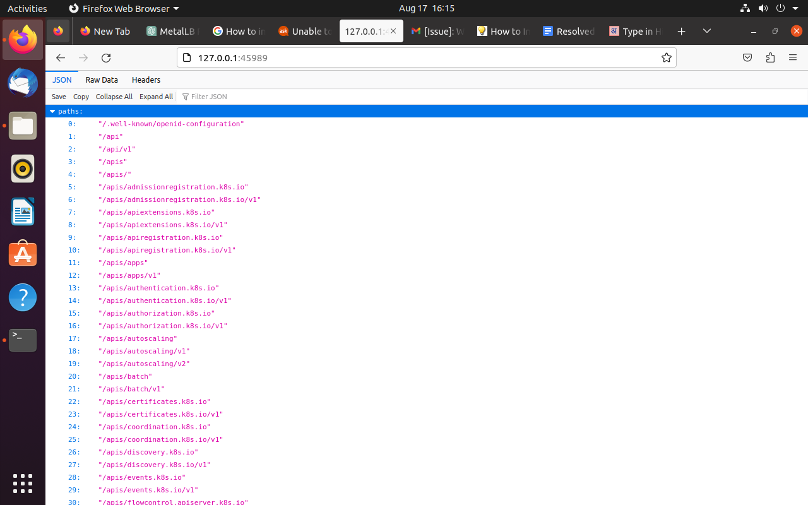

## Installation of the MetalLB

**PROBLEM 2:** Installation of the Metal Lb link is not correct. So I have followed these documents to resolve this issue.

**Step 1:** 
To install MetalLB, apply the manifest:

###### **Command:**
~~~
kubectl apply -f https://raw.githubusercontent.com/metallb/metallb/v0.13.10/config/manifests/metallb-native.yaml
~~~

* **kubectl:** This is the command-line tool for interacting with Kubernetes clusters. It allows you to manage and control Kubernetes resources and deployments.

* **apply:** This is a sub-command of kubectl. When you run kubectl apply, it instructs kubectl to apply or create Kubernetes resources defined in a YAML or JSON file.

* **-f:** This flag indicates that you're providing a file to kubectl. It's followed by the file path or URL of the manifest you want to apply.

* **https://raw.githubusercontent.com/metallb/metallb/v0.13.10/config/manifests/metallb-native.yaml:** This is the URL of the YAML file containing the Kubernetes manifest for the Metallb load balancer. Metallb is a popular network load balancer for Kubernetes clusters. The specified URL points to the raw content of the manifest file on GitHub.

###### **Command:**
~~~
kubectl apply -f https://raw.githubusercontent.com/metallb/metallb/v0.13.10/config/manifests/metallb-frr.yaml
~~~

* **kubectl:** This is the command-line tool for interacting with Kubernetes clusters. It allows you to manage and control Kubernetes resources and deployments.

* **apply:** This is a sub-command of kubectl. When you run kubectl apply, it instructs kubectl to apply or create Kubernetes resources defined in a YAML or JSON file.

* **-f:** This flag indicates that you're providing a file to kubectl. It's followed by the file path or URL of the manifest you want to apply.

* **https://raw.githubusercontent.com/metallb/metallb/v0.13.10/config/manifests/metallb-frr.yaml:** This is the URL of the YAML file containing the Kubernetes manifest specifically for the FRRouting (FRR) configuration of the Metallb load balancer. The specified URL points to the raw content of the manifest file on GitHub.

**PROBLEM 3:** When I am going to expose the service then it shows the <External IP> pending state.

###### **Command:** 

~~~
 kubectl get svc nginx-service
~~~

* **kubectl:** This is the command-line tool for interacting with Kubernetes clusters. It allows you to manage and control Kubernetes resources and deployments.

* **get svc nginx-service:** This is a combination of sub-commands and resource identifiers for kubectl. When you run kubectl get svc nginx-service, it instructs kubectl to retrieve and display information about the specified Service named "nginx-service".

**Document Link:**
 https://kubebyexample.com/learning-paths/metallb/install

Installation steps is the same but the I have add these steps in this document which is listed below:

#### Step 1: List the driver on which the minikube VM is created.

###### **Command:**
~~~
minikube profile list
~~~

* **minikube:** This is the command-line tool used to manage local Kubernetes clusters using a virtual machine driver (such as VirtualBox, KVM, or Docker).

* **profile list:** This is a sub-command of minikube. When you run minikube profile list, it instructs Minikube to list the available profiles that you can use to create and manage individual Kubernetes clusters.

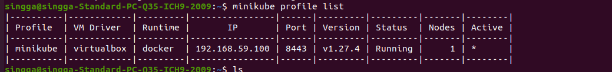

#### Step 2:</b> Verify that metallb is listed on the available add-ons for minikube.

###### **Command:**

~~~
Minikube addons list
~~~

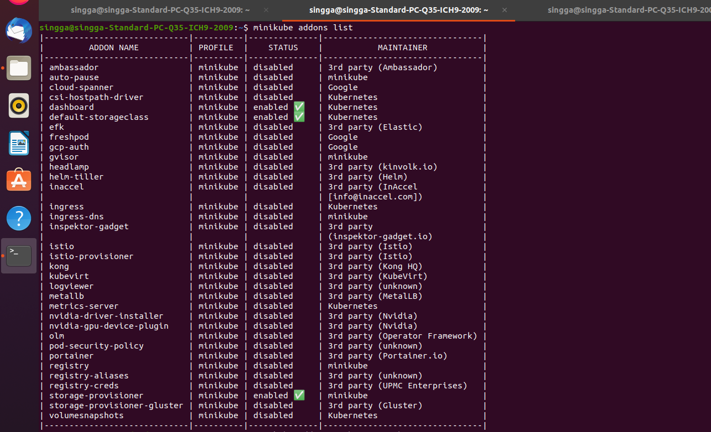

 #### Step 3: Enable the MetalLB minikube add-on. 

###### **Command:**

~~~
minikube addons enable metallb
~~~

* **minikube:** This is the command-line tool used to manage local Kubernetes clusters using a virtual machine driver (such as VirtualBox, KVM, or Docker).

* **addons enable metallb:** This is a combination of sub-commands and options for minikube. When you run minikube addons enable metallb, it instructs Minikube to enable the Metallb add-on within the cluster.

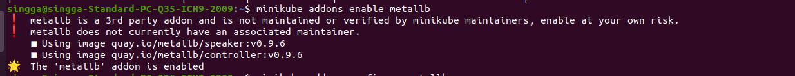

 #### Step 4:</b> Configure the IP addresses that can be used by MetalLB for the LoadBalancer services. 

###### **Command:**
~~~
 minikube addons configure metallb
~~~

* **minikube:** This is the command-line tool used to manage local Kubernetes clusters using a virtual machine driver (such as VirtualBox, KVM, or Docker).

* **addons configure metallb:** This is a combination of sub-commands and options for minikube. When you run minikube addons configure metallb, it instructs Minikube to configure the Metallb add-on within the cluster.

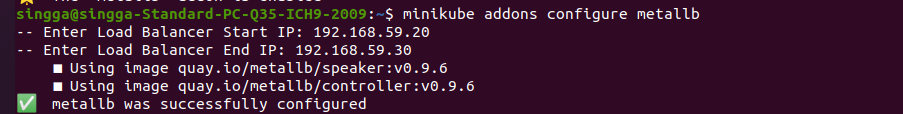

 #### Step 5: Review the applied settings. 

###### **Command:**

~~~
 kubectl get configmap/config -n metallb-system -o yaml
~~~

* **kubectl:** This is the command-line tool for interacting with Kubernetes clusters. It allows you to manage and control Kubernetes resources and deployments.

* **get configmap/config -n metallb-system -o yaml:** This is a combination of sub-commands, options, and identifiers for kubectl. When you run this command, it instructs kubectl to retrieve and display the content of the ConfigMap named "config" within the "metallb-system" namespace, and the output sh

* **get configmap/config:** This specifies that you want to retrieve a ConfigMap resource with the name "config". The "config" part is the name of the ConfigMap, and "configmap" specifies the resource type.

* **-n metallb-system:** This flag specifies the namespace where the ConfigMap is located. In this case, it's the "metallb-system" namespace.

* **-o yaml:** This flag specifies the output format you want. In this case, you're requesting the output in YAML format, which is a structured format that represents the Kubernetes resource in a human-readable way.

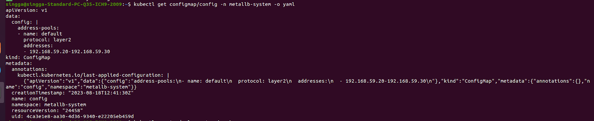

#### Step 6:
 Create a deployment with a sample application. 

###### **Command:**

~~~
 kubectl create deployment nginx \
>   --image quay.io/redhattraining/nginx:1.21 --port 80
~~~

* **kubectl:** This is the command-line tool for interacting with Kubernetes clusters. It allows you to manage and control Kubernetes resources and deployments.

* **create deployment nginx:** This part of the command indicates that you want to create a Deployment resource named "nginx". A Deployment in Kubernetes manages a set of replica pods, ensuring availability and scaling.

* **--image quay.io/redhattraining/nginx:1.21:** This flag specifies the container image to use for the pods in the Deployment. In this case, you're using the image "quay.io/redhattraining/nginx:1.21". This is the image that will be pulled and used to run the pods.

* **--port 80:** This flag specifies the port that the container in the pods will listen on. Port 80 is a common HTTP port, used for serving web content.

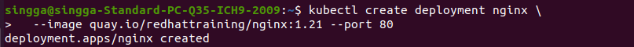
 #### Step 7: Verify that the deployment and pod are ready. 

###### **Command:** 
~~~
kubectl get deployments,pods -l app=nginx
~~~

* **kubectl:** This is the command-line tool for interacting with Kubernetes clusters. It allows you to manage and control Kubernetes resources and deployments.

* **get deployments,pods -l app=nginx:** This is a combination of sub-commands, resource types, and labels for kubectl. When you run this command, it instructs kubectl to retrieve and display information about both Deployments and Pods that have the label app=nginx.

* **get deployments,pods:** This specifies that you want to retrieve information about both Deployments and Pods. The "deployments" and "pods" parts are the resource types you're querying.

* **-l app=nginx:** This flag specifies a label selector to filter the resources you want to retrieve. In this case, you're using a label selector to query resources with the label app=nginx.

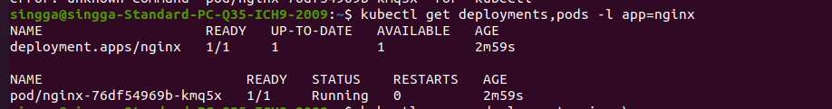
 #### Step 8: Expose the deployment to create a load balancer service

###### **Command:**
~~~
kubectl expose deployment nginx\ 
>   --type LoadBalancer --port 80 --target-port 80
~~~

* **kubectl:** This is the command-line tool for interacting with Kubernetes clusters. It allows you to manage and control Kubernetes resources and deployments.

* **expose deployment nginx:** This part of the command indicates that you want to create a Service that exposes the Deployment named "nginx". The Service allows external traffic to reach the pods managed by the Deployment.

* **--type LoadBalancer:** This flag specifies that you want to create a Service of type LoadBalancer. This means that a cloud provider-specific load balancer will be provisioned to distribute incoming traffic to the pods.

* **--port 80:** This flag specifies the port on which the Service will be exposed externally. In this case, the Service will be accessible on port 80.

* **--target-port 80:** This flag specifies the target port to which the incoming traffic should be directed. The pods in the Deployment are expected to be listening on port 80, and this is where the traffic will be forwarded.

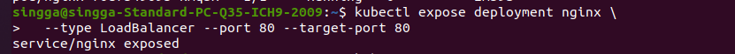

#### Step 9: Get the external IP address for the load balancer service.

###### **Command:**
~~~
kubectl get services -l app=nginx
~~~

* **kubectl:** This is the command-line tool for interacting with Kubernetes clusters. It allows you to manage and control Kubernetes resources and deployments.

* **get services -l app=nginx:** This is a combination of sub-commands, resource types, and labels for kubectl. When you run this command, it instructs kubectl to retrieve and display information about Services that have the label app=nginx.

* **get services:** This specifies that you want to retrieve information about Services. "services" is the resource type you're querying.

* **-l app=nginx:** This flag specifies a label selector to filter the resources you want to retrieve. In this case, you're using a label selector to query Services with the label app=nginx.

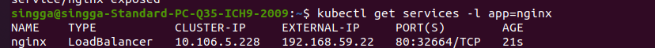

**I have added this query in this document to verfication of the load balancer service using curl and the browser.**

 #### Step 10:
  Verify that the service responds with curl
###### **Command:** 

~~~
curl http://192.168.59.22
~~~

* **curl:** This is a command-line tool for making HTTP requests. It is commonly used to fetch content from web servers, APIs, and other network resources.

* **http://192.168.59.22:** This is the URL you're passing to curl for it to fetch content from. In this case, you're using the IP address 192.168.59.22.

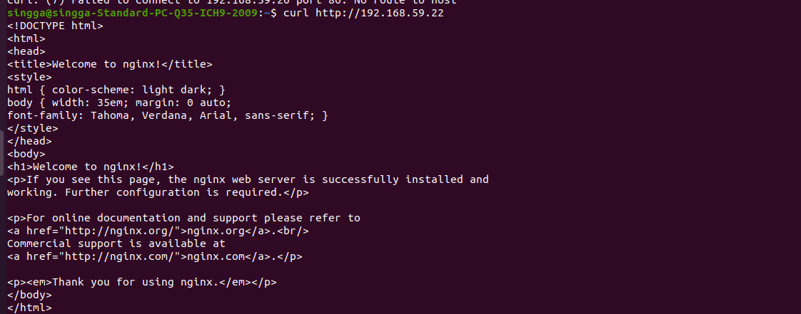

#### Step 11:  Verify that the service responds with browser.

###### **Command:** 

~~~
http://192.168.59.22
~~~
* If you're trying to access a web page, you should open a web browser and enter the URL http://192.168.59.22 in the address bar. The browser will then request the content from that URL and display it.
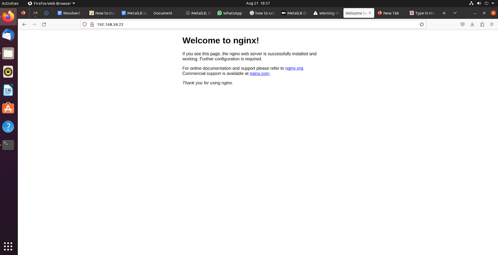

## 5. Reference Link :

* [Metallb setup](https://metallb.universe.tf/installation/)

* [Kubernetes Setup and Configuration](https://www.linuxtechi.com/install-kubernetes-on-ubuntu-22-04/)

* [Metallb Setup and Configuration](https://www.itsupportwale.com/blog/how-to-install-and-configure-metallb-on-self-managed-kubernetes/)
