<center>

# Adding a Worker Node in OCP UPI 4.13 Deployment on Bare Metal
  # (Openstack)

 </center>


 ## Task requirement:


 To add a worker node (with RHCOS 4.15.5) in OCP 4.13.5 disconnected cluster deployed on the openstack platform.

(Installation type: UPI installation on Bare Metal.)


## Environmental detail:


 Openshift 4.13 Deployed on Openstack 16.2 Platform.

   
## List of tools and technologies:


* OpenShift
* RHCOS 4.13.5 (RedHat CoreOS)
* PXE Booting(preboot execution environment) 

>
> 
## Definition of tools:

* ### **Openshift:**

 OpenShift is a cloud-native container platform developed by Red Hat (now a part of IBM). It is based on Kubernetes, an open-source container orchestration platform, and extends Kubernetes with additional features and tools to simplify the deployment, management, and scaling of containerized applications.

* ### **RHCOS:**

 It stands for "RedHat CoreOS." It is an open-source, minimal, and container-optimised operating system developed by Red Hat for running container workloads and managing Kubernetes clusters. 

* ### **PXE Booting:** 

 PXE (Preboot Execution Environment) booting is a network-based booting process that allows a computer to boot and load an operating system or other software directly from a network server, without the need for local storage devices like hard drives or USB drives.


## Architecture diagram
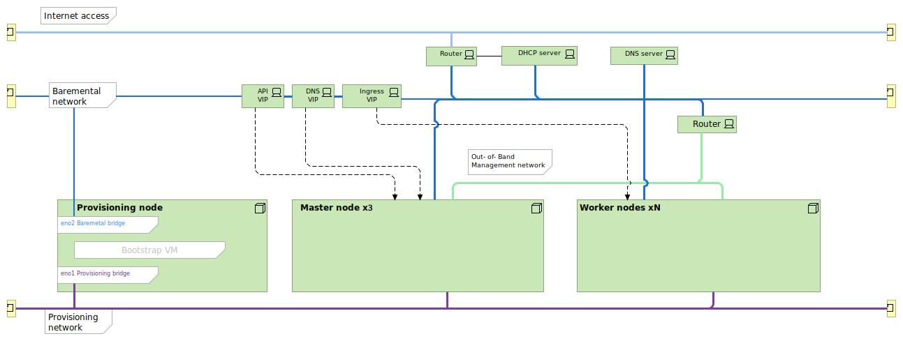


## Steps to add the worker node:


 Create an Instance in Openstack with CoreOS 4.13 ISO with required security group port, flavor and storage.

   
   ### Procedure: 
  
   It can be done both graphically or with the help of cli. However, for a beginner, It would be easy to create an instance graphically.
   
<br>


 * #### **Step 1:** 

>On the openshift console, Go to the project tab and select the project in which you want to create the worker node instance.:

\
\
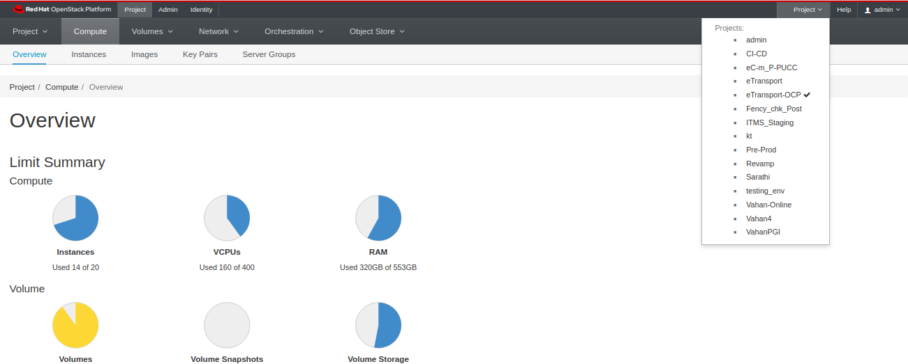

<br>

* #### **Step 2:** 


 >Go to the instances tab and click the ‘Launch Instance’ button:

\
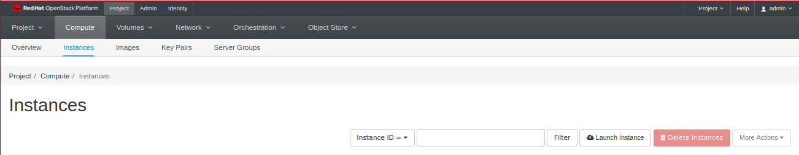

<br>

* #### **Step 3:**

 >Enter the instance Name in ‘Instance Name’ Field:


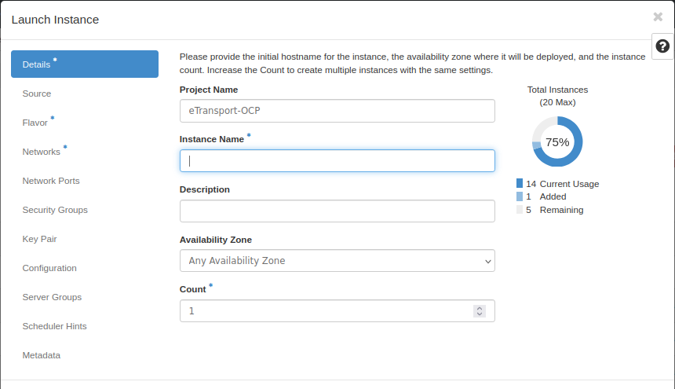

<br>

* #### **Step 4:** 

 >Select the image from the ‘boot source’, enter the Volume Size and select the uploaded RHCOS image.


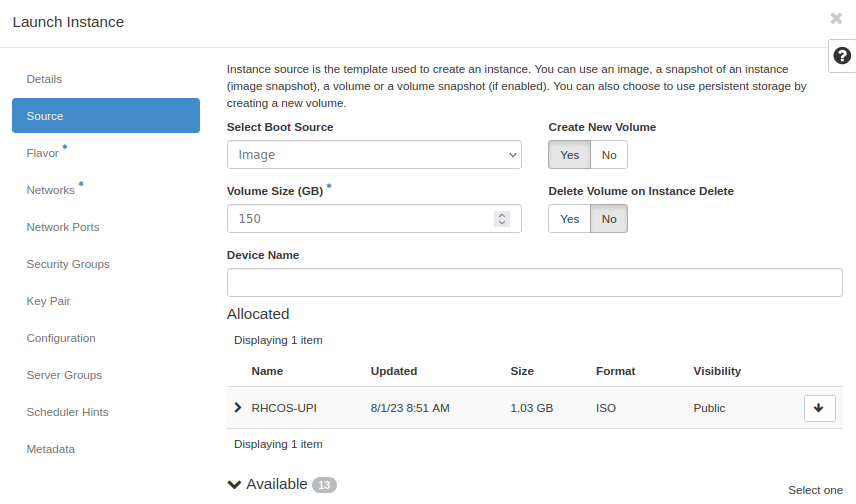

<br>

* #### **Step 5:** 

>Select the flavor as per your requirement.

 (In OpenStack, a flavor is a preset configuration that defines the CPU cores and memory of an instance.)

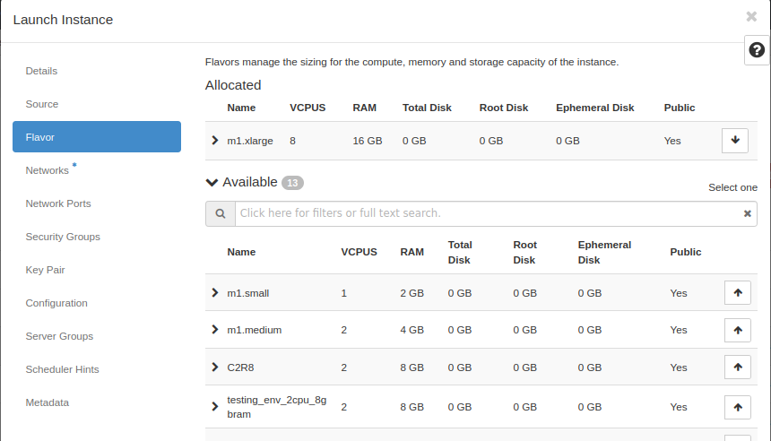

<br>

* #### **Step 6:** 

>Select the network that you want to use for your instance:


\
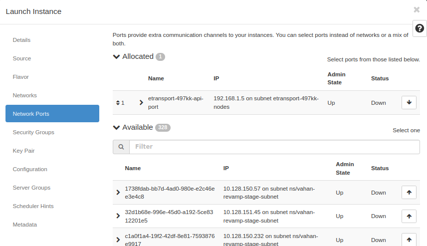

* #### **Step 7:** 

>Select the port that you want to assign to the instance:

(In openstack, A port describes the associated network configuration, such as the MAC and IP addresses to be used on that port.)

\


* #### **Step 8:** 
  

>Select the Security group that you want to attach to the instance:

(In openstack, Security groups are sets of IP filter rules that are applied to all project instances, which define networking access to the instance)

\
  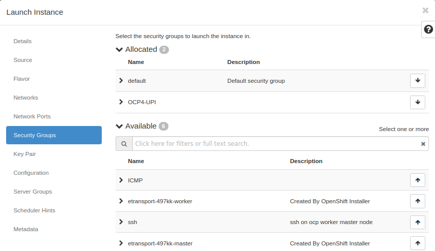


That's all! Now hit the ‘Launch instance’ button. It will create an instance with the specifications provided within a few seconds.


1. Access the instance using the OSP console and Reboot the instance using the ‘CtrlAltDel’ tab on the Openstack console.

\
   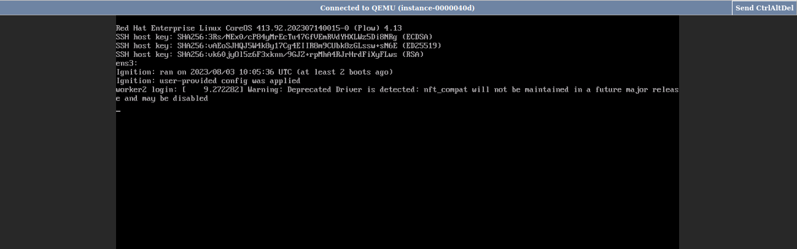

 
2. At the boot screen, Press ‘tab’. The default parameters will appear as below:

\
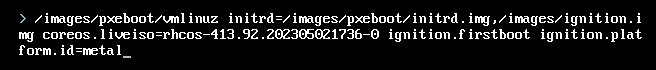

1. Now, edit the parameters as per the following and hit enter:


* Replace the parameter ‘coreos.liveiso=rhcos-413.xxxxxxxxx-0’ with ‘,/images/pxeboot/rootfs.img’

* Add the following parameters after 
 ‘ignition.platform.id=metal’:
  
  


~~~
coreos.inst.install_dev=/dev/vda coreos.inst.ignition_url=http://10.246.82.179:8080/worker.ign ip=10.246.82.143::10.246.82.129:255.255.255.192:worker1.etransport-prod.parivahan.gov.in:ens3:none nameserver=10.246.82.179
~~~


 Where,


* http://10.246.82.179:8080 → Bastion node url.


* 10.246.82.143 → IP address to be assigned to the worker node.


* 10.246.82.129 → Gateway to be assigned.


* 255.255.255.192 → Subnet to be assigned.


* worker1.etransport-prod.parivahan.gov.in → Hostname to be assigned.

* ens3 → Worker node’s network interface.

\
\
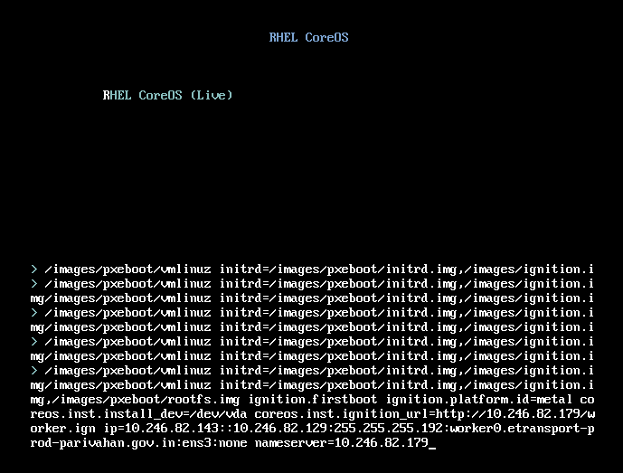

 On the bastion node:

* Approve the pending csrs using the following command:
  
```
oc get csr -o name | xargs oc adm certificate approve
```
>
* oc: This is the command-line interface (CLI) for managing OpenShift resources.
* get csr: This retrieves all Certificate Signing Requests (CSRs) in the OpenShift cluster.
* -o name: This flag and argument change the output format to display only the names of the CSRs. This is useful for piping the list to another command.
* This is a pipe, which takes the output of the command on its left and feeds it as input to the command on its right.
* xargs: This is a UNIX command that reads items from standard input, delimited by blanks or newlines, and executes a specified command using the items as arguments.
* oc adm certificate approve: This is the OpenShift command to approve a given CSR.


* Check for the newly added worker node using following command:

```
 oc get nodes 
 ```

 * oc get nodes: The command fetches and displays a list of all nodes in the OpenShift cluster.

<!-- 
 #### **Test cases list(sample format mentioned below):**

|S No.  | Component/Tool Name | Test case | Test Count | Test Cases | Expected Result | Test Passed [PASS/FAIL] | Remarks |
-------- | -------------------- | ---------- |  ----------  | ----------  | ---------------  | ----------------------- | ---------


 **Note** No test cases were performed during the activity. -->

 **Reference link**

 * https://docs.openshift.com/container-platform/4.13/machine_management/user_infra/adding-bare-metal-compute-user-infra.html

